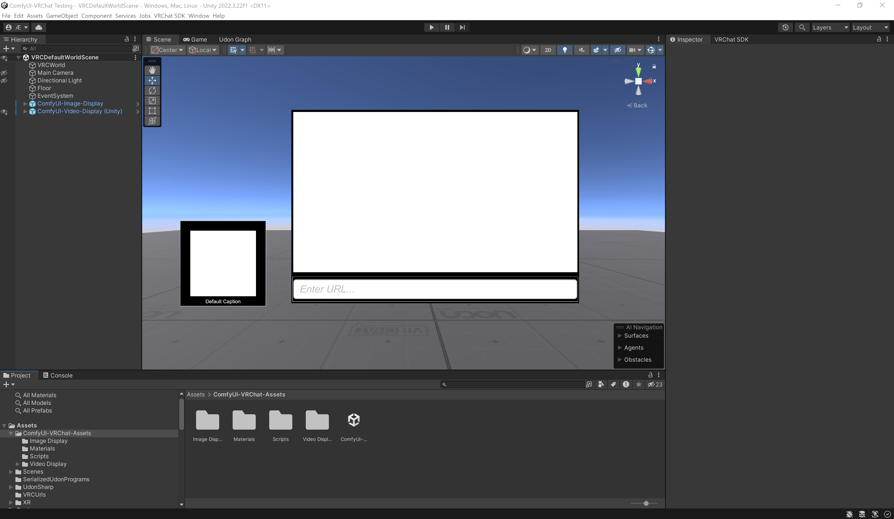
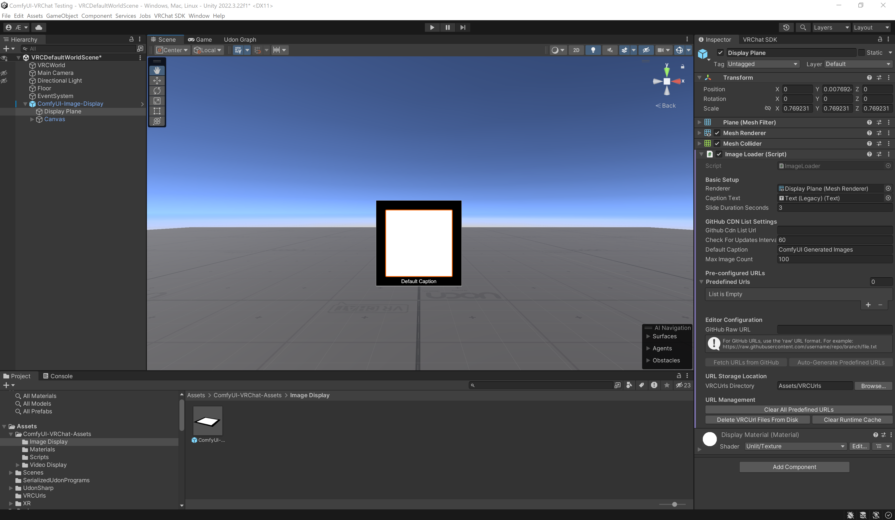
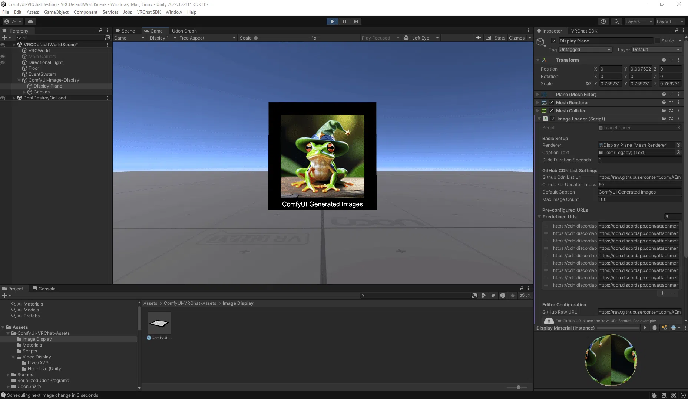
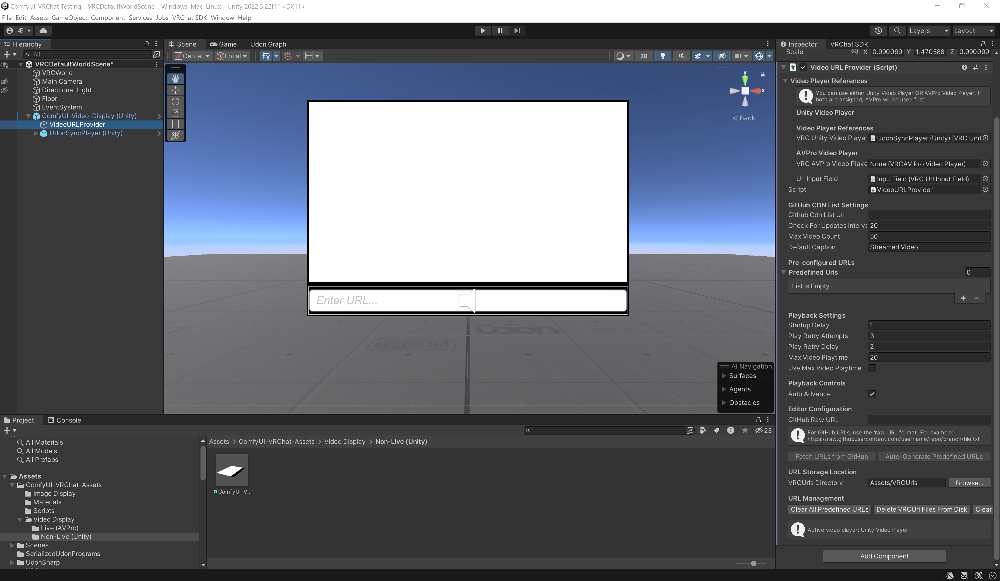

# ComfyUI-VRChat-Assets


**Display your amazing AI-generated images and videos directly in VRChat with automatic updates from ComfyUI!**

> [!NOTE]
> VR headsets are **NOT required** to use VRChat or this asset! VRChat can be played in "Desktop Mode" on any PC, and mobile support is coming soon.

ComfyUI-VRChat-Assets provides a seamless pipeline to:
- Automatically fetch and display images from GitHub repositories in VRChat
- Stream videos directly from Discord CDN URLs to VRChat video players
- Support for both Unity Video Player and AVPro Video Player
- Maintain unique identifiers between different uploads
- Handle error recovery and automatic updates

> [!TIP]
> Perfect for creating dynamic galleries and video players that automatically update with your latest AI creations!



## ✨ Features

### 🖼️ Image Loader: `ImageLoader`




- Automatically fetch images from GitHub repositories
- Support for various image formats (PNG, JPEG, WebP)
- Customizable display options
- Automatic error recovery and retries
- Support for image captions
- Runtime caching for improved performance
- Configurable update intervals
- Batch loading support for multiple images

### 🎬 Video URL Provider: `VideoURLProvider`




- Stream videos directly from Discord CDN and other sources
- Support for both Unity Video Player and AVPro Video Player
- Configurable playback settings
- Automatic recovery from video playback errors
- Integration with VRCUrlInputField for manual control
- Playlist functionality with automatic advancement
- Built-in diagnostics and troubleshooting

### 🔄 GitHub Integration

- Automatic checking for new content
- Support for Markdown-formatted URL lists
- Configurable update intervals
- Built-in error handling for network issues
- Caption extraction for improved user experience

## 🔗 Complete Workflow: ComfyUI to VRChat

This package is designed to work seamlessly with [ComfyUI-DiscordSend](https://github.com/AEmotionStudio/ComfyUI-DiscordSend) to create a pipeline from AI generation to VRChat display:

1. Generate content in ComfyUI
2. Use ComfyUI-DiscordSend to send images/videos to Discord and save CDN URLs to GitHub
3. Configure these URLs in ComfyUI-VRChat-Assets components and publish your VRChat world

> [!IMPORTANT]
> **VRChat worlds cannot dynamically fetch new URLs after publishing!**
> 
> Due to VRChat's security model, all URLs must be pre-defined in Unity before publishing your world. The workflow is:
> 1. Generate and update your GitHub URL list using ComfyUI-DiscordSend
> 2. In Unity, use the editor tools to fetch these URLs and generate VRCUrl objects
> 3. Publish your VRChat world with these pre-defined URLs
> 4. To add new content, you must repeat this process and republish your world
>
> The only exception is streaming via AVPro Video Player to a specific URL that you've already defined, but this requires careful setup and may have limitations.

### Setting Up the ComfyUI-DiscordSend Integration

To use this complete workflow, you need to:

1. Install [ComfyUI-DiscordSend](https://github.com/AEmotionStudio/ComfyUI-DiscordSend) in your ComfyUI setup
2. Configure Discord webhooks to send images/videos
3. Enable the GitHub CDN URL saving feature in ComfyUI-DiscordSend

## 📥 Installation

### Requirements

- Unity 2022.3.22f1
- VRChat SDK3 for Worlds
- UdonSharp 1.0 or newer
- VRChat account with at least "New User" trust rank to publish worlds
  
> [!NOTE]
> To publish your own VRChat worlds, you need a VRChat account that has reached at least "New User" trust rank. For more information on VRChat's trust system, see the [official VRChat documentation](https://docs.vrchat.com/docs/vrchat-community-trust-system).

### Using VRChat Creator Companion (Recommended)

The [VRChat Creator Companion (VCC)](https://vcc.docs.vrchat.com/) provides the easiest way to set up your VRChat development environment:

1. **Download and Install the VCC**
   - Get the Creator Companion from the [official VRChat documentation](https://vcc.docs.vrchat.com/)
   - Follow the installation instructions provided on the website

2. **Create a New VRChat World Project**
   - Launch the Creator Companion
   - Click "New Project" and select a world template
   - Configure your project settings and click "Create Project"
   - This will automatically set up a Unity project with all required VRChat SDKs and dependencies

3. **Install Required Packages**
   - In the Creator Companion, select your project
   - Go to the "Manage Project" tab
   - Ensure "World SDK" is installed
   - Add UdonSharp from the "Community Packages" section

4. **Import ComfyUI-VRChat-Assets**
   - Once your VRChat project is set up through the Creator Companion, proceed with importing this package as described below

Using the Creator Companion simplifies the setup process by handling Unity version management, SDK installation, and package dependencies for you.

### Quick Setup with Prefabs

For your convenience, this package includes ready-to-use prefabs:

1. **Image Display Prefab** - For displaying images from GitHub repositories
2. **Unity Video Player Prefab** - For playing videos using the Unity Video Player
3. **AVPro Video Player Prefab** - For playing videos using the AVPro Video Player

To use these prefabs:

1. **Import the Package**
   - Download the latest release from GitHub
   - Import the package into your Unity project using one of these methods:
     - Method 1: Go to Assets > Import Package > Custom Package and select the downloaded .unitypackage file
     - Method 2: Drag and drop the .unitypackage file into your Unity Project window

2. **Drag and Drop the Prefab**
   - Locate the prefabs in the Project panel under `ComfyUI-VRChat-Assets/Prefabs/`
   - Drag your desired prefab into your scene hierarchy

3. **Configure the GitHub URL**
   - Select the prefab in the hierarchy
   - In the Inspector panel, find the `GitHub Raw URL` field
   - Enter your raw GitHub URL containing the image or video URLs

4. **Generate Predefined URLs**
   - Click the `Fetch URLs from GitHub` button to test your configuration
   - Click the `Auto-Generate Predefined URLs` button to populate the URL list

5. **Adjust Settings as Needed**
   - Configure update intervals, playback options, and other settings based on your preferences

That's it! Your prefab is now configured to automatically fetch and display content from your GitHub repository.

### Manual Setup Steps

If you prefer to set up components manually:

1. **Set Up Image Display**
   
   a. Create a new GameObject in your scene
   
   b. Add the `ImageLoader` component
   
   c. Configure GitHub URL and update settings
   
   d. Add Raw Image components as children for display

2. **Set Up Video Player**
   
   a. Create a new GameObject in your scene
   
   b. Add either a VRC Unity Video Player or AVPro Video Player
   
   c. Add the `VideoURLProvider` component
   
   d. Configure GitHub URL for the CDN list

3. **Configure Update Intervals**
   
   a. Set appropriate update intervals based on your world's usage
   
   b. For public worlds, consider longer intervals (300+ seconds)
   
   c. For private worlds, shorter intervals (60-120 seconds) are suitable

## 🚀 Usage

### Setting Up GitHub Content Lists

> [!NOTE]
> While the ComfyUI-DiscordSend plugin automatically creates properly formatted Markdown files with Discord CDN links, this component can work with any valid URL source, not just Discord CDNs. You can manually create Markdown files with URLs from any image/video hosting service.

#### Image URLs Format

Create a Markdown file in your GitHub repository with image URLs in any of these formats:

```markdown
# Image Gallery
1. https://example.com/image1.png
2. https://example.com/image2.jpg
3. Title: https://example.com/image3.webp
```

#### Video URLs Format

Create a Markdown file with video URLs:

```markdown
# Video Playlist
1. My Cool Video: https://cdn.discordapp.com/attachments/123456789/video1.mp4
2. Awesome Creation: https://cdn.discordapp.com/attachments/123456789/video2.mp4
```

#### Example Repository

For working examples of CDN URL formatting and organization, check out my example repository:
[ComfyUI-CDN-Link-Examples](https://github.com/AEmotionStudio/ComfyUI-CDN-Link-Examples) - This repository demonstrates proper formatting of CDN URLs for image and video casting to VRChat.

### Using ComfyUI-DiscordSend to Generate GitHub URL Lists

ComfyUI-VRChat-Assets is designed to work seamlessly with the GitHub CDN URL lists generated by [ComfyUI-DiscordSend](https://github.com/AEmotionStudio/ComfyUI-DiscordSend). Here's how to set up the complete workflow:

#### 1. Configure ComfyUI-DiscordSend GitHub Integration

In your ComfyUI workflow:

1. Add either the `DiscordSendSaveImage` or `DiscordSendSaveVideo` node
2. Enable the following options:
   - `send_to_discord`: Set to True
   - `save_cdn_urls`: Set to True
   - `github_cdn_update`: Set to True
   - `github_repo`: Set to your repository in format "username/repo"
   - `github_token`: Set to your personal access token
   - `github_file_path`: Set to the path for your URLs file (e.g., "image_urls.md" or "video_urls.md")


#### 2. Create a GitHub Personal Access Token

1. Go to GitHub → Settings → Developer settings → Personal access tokens → Fine-grained tokens
2. Click "Generate new token"
3. Set an appropriate expiration date
4. Select the specific repository you want to use
5. Under "Repository permissions," grant "Contents" Read and Write access
6. Generate and copy the token to use in ComfyUI-DiscordSend


#### 3. Set Up Your GitHub Repository

1. Create a new repository or use an existing one
2. You don't need to manually create the URL list file; ComfyUI-DiscordSend will create it automatically
3. For better organization, you can create separate files for images and videos:
   - `image_urls.md` for images
   - `video_urls.md` for videos

#### 4. GitHub Token Security

ComfyUI-DiscordSend includes several security measures for GitHub tokens:

- Tokens are hidden from logs with [REDACTED_TOKEN] placeholders
- Tokens are removed from workflow JSON files before sharing
- Tokens are protected in error messages and tracebacks

> [!WARNING]
> Always treat GitHub tokens as sensitive information:
> - Never share your token in public forums or Discord
> - Set an appropriate expiration date for your token
> - Use repository-specific access when possible
> - Regularly rotate your tokens for better security
> - Monitor your token usage in GitHub settings

#### 5. URL List Format

ComfyUI-DiscordSend will automatically update your GitHub repository with URLs in this format:

```markdown
# Discord CDN URLs - Last Updated: YYYY-MM-DD HH:MM:SS

## Images/Videos:

1. 2023-09-01_14-30-45_MyImage.png: https://cdn.discordapp.com/attachments/123456789/image.png
2. 2023-09-01_15-45-30_MyVideo.mp4: https://cdn.discordapp.com/attachments/123456789/video.mp4
```

This format is perfectly compatible with ComfyUI-VRChat-Assets' URL parsing system.

### Editor Configuration

#### ImageLoader Component


1. Set the `GitHub Raw URL` to your Markdown file's raw URL
2. Click `Fetch URLs from GitHub` to test your configuration
3. Click `Auto-Generate Predefined URLs` to populate the URL list
4. Configure update intervals and display settings

#### VideoURLProvider Component


1. Assign your video player (Unity or AVPro)
2. Set the `GitHub Raw URL` to your video list's raw URL
3. Configure playback settings
4. Click `Fetch URLs from GitHub` to test your configuration
5. Click `Auto-Generate Predefined URLs` to populate the URL list

### Getting the Raw GitHub URL

To get the raw URL for your GitHub markdown file:

1. Navigate to your file in GitHub repository
2. Click the "Raw" button
3. Copy the URL from your browser address bar
4. The URL should look like: `https://raw.githubusercontent.com/username/repo/branch/path/to/file.md`


### Runtime Controls

The components provide several public methods for control:

- `NextVideo()` - Advance to the next video
- `PreviousVideo()` - Go to the previous video
- `CheckForNewUrls()` - Manually check for updates
- `ClearOlderUrls()` - Clear the runtime cache

## 📋 Advanced Configuration

### Image Loader Options

| Option | Description |
|--------|-------------|
| **GitHub Settings** ||
| `githubRawUrlString` | Raw URL to the GitHub Markdown file |
| `checkIntervalSeconds` | How often to check for updates (in seconds) |
| `maxImagesToKeep` | Maximum number of images to keep in memory |
| **Display Settings** ||
| `defaultCaption` | Default caption for images without specific captions |
| `newestImagesFirst` | Show newest images first |
| `liveUpdateMode` | Automatically cycle through new images |
| **Error Handling** ||
| `retryCount` | Number of retry attempts for failed downloads |
| `retryDelay` | Delay between retry attempts (in seconds) |

### Video URL Provider Options

| Option | Description |
|--------|-------------|
| **Video Player References** ||
| `unityVideoPlayer` | Reference to the VRCUnityVideoPlayer |
| `avproVideoPlayer` | Reference to the VRCAVProVideoPlayer |
| `urlInputField` | Optional VRCUrlInputField for manual control |
| **GitHub CDN List Settings** ||
| `githubRawUrlString` | Raw URL to the GitHub Markdown file |
| `checkIntervalSeconds` | How often to check for updates (in seconds) |
| `maxVideosToKeep` | Maximum number of videos in the playlist |
| `defaultCaption` | Default caption for videos without specific captions |
| **Playback Settings** ||
| `retryCount` | Number of retry attempts for failed playback |
| `retryDelay` | Delay between retry attempts (in seconds) |
| `maxVideoPlaytime` | Maximum time to play a video before advancing (in seconds) |
| `enforceMaxPlaytime` | Whether to enforce the maximum playtime |
| `autoAdvance` | Automatically advance to the next video when current one ends |

## ❓ Troubleshooting

### Common Issues

#### Images Not Loading

- **Check GitHub URL**: Ensure your raw GitHub URL is correct and accessible
- **Verify Image URLs**: Make sure image URLs in your Markdown file are direct links to images
- **Check Update Interval**: If set too high, updates may appear delayed
- **Increase Retry Count**: For unreliable networks, increase the retry count

#### Videos Not Playing

- **Check Video Format**: VRChat best supports H.264 MP4 videos
- **Check Video Size**: Keep videos under 100MB for reliable playback
- **Check CDN URL**: Ensure video URLs are direct links to videos
- **Use AVPro Player**: For better compatibility, use the AVPro Video Player
- **Verify Network Access**: Ensure the video CDN is accessible to VRChat

#### Discord CDN Link Expirations

> [!IMPORTANT]
> **Discord CDN URLs are not permanent and may expire!**
>
> - Standard attachments in Discord channels typically remain accessible for a long period (months to years)
> - However, Discord does not guarantee permanent availability of these URLs
> - For more reliable long-term storage, consider using a dedicated image/video hosting service
> - Schedule regular updates of your content to ensure continued availability
> - Consider implementing a rotation system where older content is replaced with newer content

#### VRChat-Specific Limitations

- **URL Count**: VRChat has limits on the number of VRCUrl objects that can be used in a single world
- **Memory Usage**: Loading many high-resolution images or videos can consume significant memory
- **Network Bandwidth**: VRChat may throttle bandwidth for video streaming in busy instances
- **Video Formats**: Only certain video formats are supported (H.264 MP4 is most reliable)
- **Video Resolution**: Maximum supported resolution is typically 1080p for reliable playback
- **Instance Rejoin**: When users rejoin an instance, they may need to wait for content to reload
- **Quest Compatibility**: Quest users face stricter limitations on video playback capabilities
- **Texture Size**: VRChat has maximum texture size limitations (typically 4096×4096)

#### Videos Stop Playing After a Few Seconds

- **Check Video Format**: Ensure videos are in a compatible format
- **Increase Retry Count**: Set a higher retry count for playback
- **Check Video Playtime**: Ensure max playtime is set appropriately
- **Disable Auto Advance**: If videos are cutting short, try disabling auto advance

#### GitHub Integration Issues

- **Token Permissions**: Ensure your GitHub token has "Contents" write access
- **Repository Access**: Verify the token has access to the specified repository
- **File Path**: Check that the file path is valid (no leading slash needed)
- **URL Format**: The raw GitHub URL should start with `https://raw.githubusercontent.com/`
- **Rate Limits**: Be aware of GitHub API rate limits for token requests

### Additional Resources

> [!TIP]
> For more in-depth information about VRChat world creation and troubleshooting, consult the [official VRChat Creators Documentation](https://creators.vrchat.com/getting-started).
>
> If you have specific questions about this asset or need help with setup, please join our [Discord community](https://discord.gg/UzC9353mfp) where we provide support and share tips for getting the most out of ComfyUI-VRChat-Assets.

### Diagnostics

Both components include built-in diagnostic methods:

- **Video URL Provider**:
  - `DiagnosePlaylistIssues()` - Outputs detailed diagnostic information to the debug console
  - `DebugShowPlaylist()` - Shows the current playlist in the debug console

- **Image Loader**:
  - Runtime console logging for troubleshooting download issues

## 📜 License

This project is licensed under the MIT License - see the LICENSE file for details.

## 🤝 Contributing

Contributions are welcome! Feel free to:
- Report bugs
- Suggest features
- Submit pull requests

Please follow the standard GitHub flow for contributions.

## 🙏 Acknowledgements

- VRChat team for the SDK and platform
- UdonSharp developers for making VRChat world scripting accessible
- ComfyUI team for the amazing AI image generation platform
- All contributors and users who provide feedback

## 🔗 Connect with me

- YouTube: [AEmotionStudio](https://www.youtube.com/@aemotionstudio/videos)
- GitHub: [AEmotionStudio](https://github.com/AEmotionStudio)
- Discord: [Join our community](https://discord.gg/UzC9353mfp) - Get help with setup and share your creations!
- Website: [aemotionstudio.org](https://aemotionstudio.org/)

## ☕ Support

If you find ComfyUI-VRChat-Assets useful, consider supporting its development:

[](https://ko-fi.com/aemotionstudio)

Your support helps me dedicate more time to maintaining and improving this project and others with new features, bug fixes, and better documentation.

### 💖 Additional Ways to Support

- ⭐ Star the repository
- 📢 Share it with others
- 🛠️ Contribute to its development
- 📸 Share creations made with this tool

For business inquiries or professional support, please contact me through my [website](https://aemotionstudio.org/) or join my [Discord server](https://discord.gg/UzC9353mfp).
